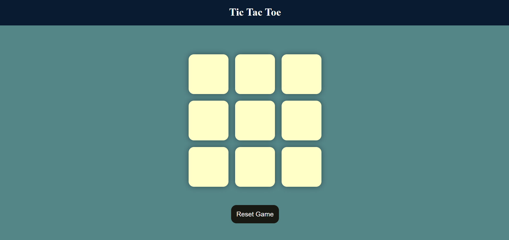

# Tic Tac Toe Game

An interactive Tic Tac Toe game built with HTML, CSS, and JavaScript. This project is part of my learning journey in web development and is designed to provide a fun and engaging way to play Tic Tac Toe in the browser. The game is now deployed and accessible through GitHub Pages.

## Table of Contents

- [Features](#features)
- [Live Demo](#live-demo)
- [Screenshots](#screenshots)
- [Technologies Used](#technologies-used)

## Features

- Interactive user interface
- Highlights the winner when the game ends
- Option to reset and play again
- **Responsive design** for different screen sizes

## Live Demo

Play the live version of the game here: [Tic Tac Toe](https://tonystark-19.github.io/Tic-Tac-Toe/)

## Screenshots

## Technologies Used

- **HTML5** for structuring the content
- **CSS3** for styling the game and making it responsive
- **JavaScript** for game logic and interaction  

---
